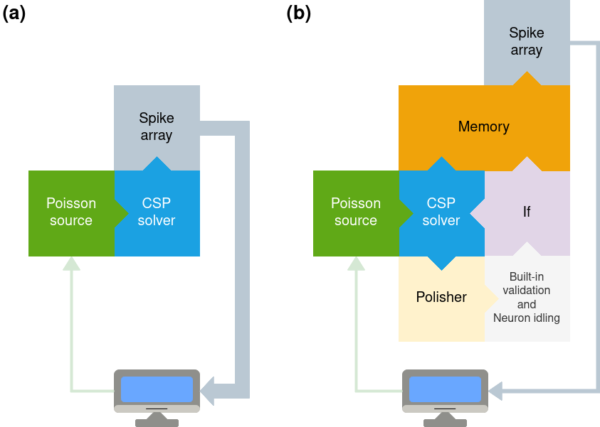

# <b>Efficient solution validation of constraint satisfaction problems on neuromorphic hardware: the case of Sudoku puzzles</b>
## <b>Background</b>

Optimization problems target the identification of the best solution among a number of possible candidates, given a specific task. The complexity of such problems is proportionally related to the degrees of freedom of the considered system, which affect the solutions space to be investigated: the more complex the problem, the larger the number of possible solutions and the less feasible the brute force approach to find the optimal one.

Over the years, numerous methods have been developed to address optimization. Among them, analytical approaches, based on the Lagrange multipliers or on linear programming, and the most modern strategies relying on statistical approaches and machine learning (ML) methods. Additionally, a frontier application is represented by SNNs, which can explore the possible solutions by exploiting an attractor dynamics with a considerable reduction in computational and energy cost.

CSPs are a specific type of optimization problems which belong to the NP-complete set. Their mathematical formulation is based on the triplet $\langle X, D, C \rangle$ where:

- $X={X_1, X_2, ..., X_n}$ describes the set of variables present in the problem;
- $D={D_1, D_2, ..., D_n}$ describes the set of domains the variables belong to;
- $C={C_1, C_2, ..., C_n}$ defines the set of constraints.


Among the above mentioned examples of CSP, the Latin Square problem consists of a matrix with $n \times n$ cells, partially filled with $n$ different elements, such that once solved each symbol appears in each row and column only once. In the Sudoku variant, the structure is constituted by a square of $9 \times 9$ cells, subdivided into $9$ blocks of $3 \times 3$ sub-squares. Each cell of the Sudoku puzzles must be filled in with numbers from $1$ to $9$. Solutions to Sudoku puzzles and other CSPs can be investigated by means of SNNs [[1]](#1), [[2]](#2), [[3]](#3), [[4]](#4), [[5]](#5), [[6]](#6) by replacing the standard nonlinearity adopted in ANNs through perceptron-based units with bioinspired elements such as leaky integrate-and-fire (LIF) neurons. A generalized formulation for CSP mapping onto SNNs was shown by Jonke et al. in [[2]](#2), where a methodology to model the energy landscape of a given problem through the topological structure of a neuromorphic model was proposed. The resulting dynamics of the network corresponds to a dynamical system with a temporal evolution described through an attractor model [[10]](#10), with a continuous exploration of possible states related to the original problem, whose fixed points correspond to the possible solutions.

In [[4]](#4), SNNs designed to translate the mathematical formulation of the problem into the number of neurons and their synaptic connections are used for a stochastic search of the solution. Precisely, three CSP classes are taken into account, namely Graph Coloring, Latin Square Problem and Ising Model, showing the feasibility of such approach.
Nonetheless, some limitations can be identified which partially limit the prospective impact of the proposed methodology. Specifically, three main aspects can be outlined. First, the fixed simulation time hinders the possibility of stopping the process once a solution is found, translating into an unnecessary energy consumption. Similarly, performing the solution validation on an external platform with respect to the one onto which the SNN runs implies data preparation and transfer which induce further time and energy consumption. Third, reliability issues affecting the problem mapping can arise if specific design choices in the clues definition are not taken.

Further studies [[7]](#7), [[8]](#8), [[9]](#9) have also investigated neuromorphic approaches to the solution of the Latin square problem, exploring different methodologies and platforms and validating the efficacy of novel neuron models in the domain of CSPs.

This work presents a novel approach to address Constraint Satisfaction Problems through Spiking Neural Networks (SNNs) utilising neuromorphic tools like the GeNN framework and the SpiNNaker platform. We propose a new fully spiking pipeline that incorporates a constraint stabilization strategy, a neuron idling mechanism, and a built-in validation procedure. Our pipeline targets efficiency and performance of SNN-based solvers for Sudoku puzzles, leading to improvements in success rates and data transmission compared to previous solutions. Specifically, the reduction of extracted spikes, ranging from 54.63\% to 99.98\%, provides extraction time reduced by values between 88.56\% and 96.41\%. This results in significant enhancements in terms of energy efficiency and computational performance. Therefore, we show further evidence of the potential advantages of brain-inspired approaches that rely on neuromorphic HW for implementing effective and low-power solutions, which are suitable for real-world problems that characterise constrained key technological domains such as AI, IoT and Industry 4.0.

<center>
    
</center>


### Reference
The reference material used to develop the research is obtained from:

- <a id="1">[1]</a> Malaka, Rainer, and Sebastian Buck. "Solving nonlinear optimization problems using networks of spiking neurons." Proceedings of the IEEE-INNS-ENNS International Joint Conference on Neural Networks. IJCNN 2000. Neural Computing: New Challenges and Perspectives for the New Millennium. Vol. 6. IEEE, 2000.
- <a id="2">[2]</a> Jonke, Zeno, Stefan Habenschuss, and Wolfgang Maass. "Solving constraint satisfaction problems with networks of spiking neurons." Frontiers in neuroscience 10 (2016): 118.
- <a id="3">[3]</a> Habenschuss, Stefan, Zeno Jonke, and Wolfgang Maass. "Stochastic computations in cortical microcircuit models." PLoS computational biology 9.11 (2013): e1003311.
- <a id="4">[4]</a> Fonseca Guerra, Gabriel A., and Steve B. Furber. "Using stochastic spiking neural networks on spinnaker to solve constraint satisfaction problems." Frontiers in neuroscience 11 (2017): 714.
- <a id="5">[5]</a> Alom, Md Zahangir, et al. "Quadratic unconstrained binary optimization (QUBO) on neuromorphic computing system." 2017 International Joint Conference on Neural Networks (IJCNN). IEEE, 2017.
- <a id="6">[6]</a> Chen, Zihao, et al. "ON-OFF Neuromorphic ISING Machines using Fowler-Nordheim Annealers." arXiv preprint arXiv:2406.05224 (2024).
- <a id="7">[7]</a> Boreland, B., G. Clement, and Herb Kunze. "Set selection dynamical system neural networks with partial memories, with applications to Sudoku and KenKen puzzles." Neural Networks 68 (2015): 46-51.
- <a id="8">[8]</a> Ostrau, Christoph, et al. "Comparing neuromorphic systems by solving sudoku problems." 2019 International Conference on High Performance Computing & Simulation (HPCS). IEEE, 2019.
- <a id="9">[9]</a> Tao, Liying, et al. "Blended Glial Cell’s Spiking Neural Network." IEEE Access 11 (2023): 43566-43582.
- <a id="10">[10]</a> Khona, Mikail, and Ila R. Fiete. "Attractor and integrator networks in the brain." Nature Reviews Neuroscience 23.12 (2022): 744-766.


## Virtual environment configuration

The project makes use of the virtual environment creator conda.

Clone git repo:
```
git clone https://github.com/neuromorphic-polito/sudokuValidation.git
```
Conda installation:
```
wget https://repo.anaconda.com/miniconda/Miniconda3-py38_4.10.3-Linux-x86_64.sh
chmod +x Miniconda3-py38_4.10.3-Linux-x86_64.sh
./Miniconda3-py38_4.10.3-Linux-x86_64.sh
```
To create the virtual environment and install all the necessary packages, run the commands:
```
cd sudokuValidation
chmod +x installViaConda.sh
./installViaConda.sh
```


## Project Structure
- `0-preliminaryAnalysis`: individual analysis of network components;
- `1-simulation`: experiment execution folder;
- `2-analysis`: metrics recovery;
- `results`: destination folder for the simulation;


## Cite us

If you use this code in your academic work, please cite the following article:

> Pignari, R., Fra, V., Macii, E., & Urgese, G. (2025). Efficient solution validation of constraint satisfaction problems on neuromorphic hardware: the case of Sudoku puzzles. IEEE Transactions on Artificial Intelligence. [10.1109/TAI.2025.3536428](https://doi.org/10.1109/TAI.2025.3536428)

Formato BibTeX:
```bibtex
@article{pignari2025efficient,
  title={Efficient solution validation of constraint satisfaction problems on neuromorphic hardware: the case of Sudoku puzzles},
  author={Pignari, Riccardo and Fra, Vittorio and Macii, Enrico and Urgese, Gianvito},
  journal={IEEE Transactions on Artificial Intelligence},
  year={2025},
  publisher={IEEE}
}
```


## Contact
- riccardo.pignari@polito.it
- vittorio.fra@polito.it
- gianvito.urgese@polito.it
 